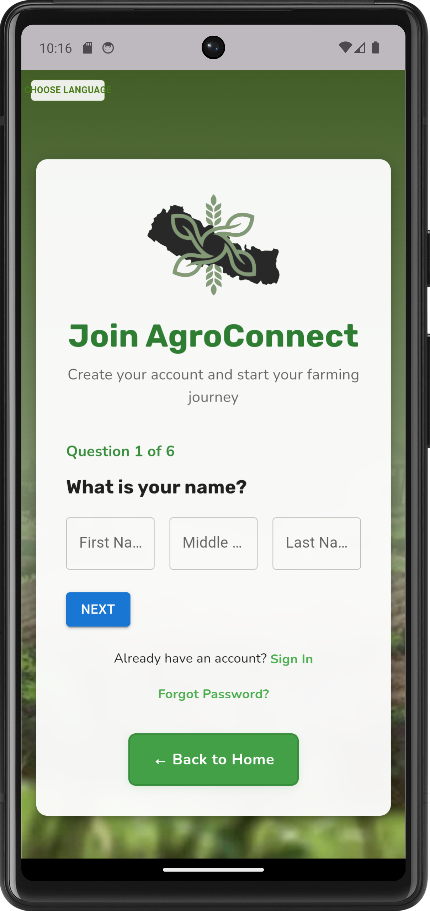

# कृषि साथी (Krishi-Sathi) - Flutter WebView App

<div align="center">
  
  <h3>🌾 A WebView Application for AgroConnect Ecosystem</h3>
</div>

## 📱 Download APK

[](https://github.com/roshanCodesStuff/krishi-sathi/releases/download/v1.0.0/app-release.apk)


## 🎯 Purpose

**कृषि साथी (Krishi-Sathi)** is a Flutter-based WebView application designed to provide seamless access to the AgroConnect web platform within a native mobile experience. This app serves as a bridge between the web-based agricultural services and mobile users, offering:

- **Native Mobile Experience:** Wrapped web content in a native Flutter application
- **Seamless Integration:** Direct access to AgroConnect services
- **Cross-Platform Compatibility:** Built with Flutter for Android and iOS support (when configured)
- **Performance Optimized:** Efficient WebView implementation with loading states

## ✨ Features

### Core Functionality
- **WebView Integration:** Seamless rendering of web content using `webview_flutter`
- **Loading Indicators:** Visual feedback during page loading with progress indicators
- **Responsive Design:** Optimized for various screen sizes and orientations
- **Native Navigation:** Smooth integration with device navigation patterns

### User Experience
- **Loading States:** Custom loading screen with "कृषि साथी लोड हुँदैछ..." message
- **Progress Tracking:** Real-time loading progress monitoring
- **Error Handling:** Graceful handling of network issues and loading failures
- **Smooth Performance:** Optimized WebView configuration for better performance

## 🛠️ Technologies Used

- **Flutter 3.8.1+** - Cross-platform mobile development framework
- **Dart** - Programming language
- **webview_flutter 4.13.0** - WebView functionality
- **Material Design** - UI/UX design system
- **Android SDK 21+** - Minimum Android API level

## 📱 Screenshots

### Main Interface

<div align="center">
  
</div>

The app features a clean, modern interface with:
- AgroConnect Nepal branding with green gradient design
- "GROW YOUR FARM, GROW YOUR KNOWLEDGE" headline
- Responsive WebView content displaying the full website
- Native mobile navigation with hamburger menu
- Professional agricultural theme with green color scheme

### App Features
- **Loading Screen:** Custom loading indicator with Nepali text
- **WebView Integration:** Seamless website rendering
- **Mobile-Optimized:** Responsive design for all screen sizes
- **Native Performance:** Smooth scrolling and interactions

## 📂 Project Structure

```
krishi-sathi/
├── android/                    # Android-specific configurations
├── assets/
│   ├── icon/
│   │   └── app_icon.png       # Application icon
│   └── snapshot/
│       └── app_snap.png       # Screenshot of the app
├── lib/                       # Dart source code
│   └── main.dart             # Main application entry point
├── build/                    # Generated build artifacts (ignored by Git)
├── .dart_tool/               # Dart tool configurations (ignored by Git)
├── .idea/                    # IntelliJ/Android Studio project files (ignored by Git)
├── web/                      # Web platform support
├── test/                     # Test files
├── .gitignore               # Specifies intentionally untracked files to ignore
├── .metadata                # Flutter project metadata
├── analysis_options.yaml   # Dart linter rules
├── pubspec.lock            # Records specific versions of dependencies
├── pubspec.yaml            # Defines dependencies and project metadata
└── README.md               # This file
```

## 🚀 Getting Started

### Prerequisites
- Flutter SDK (version 3.8.1 or higher)
- Android Studio or VS Code with Flutter extensions
- Android SDK (API level 21 or higher)
- Git for version control

### Installation

1. **Clone the repository**
   ```bash
   git clone https://github.com/roshanCodesStuff/krishi-sathi.git
   cd krishi-sathi
   ```

2. **Install dependencies**
   ```bash
   flutter pub get
   ```

3. **Run the application**
   ```bash
   flutter run
   ```

### Building for Production

#### Android APK
```bash
flutter build apk --release
```

#### Android App Bundle (AAB)
```bash
flutter build appbundle --release
```

## ⚙️ Configuration

### WebView URL
The app is configured to load the AgroConnect demo website. To change the target URL, modify the `Uri.parse()` call in `lib/main.dart`:

```dart
..loadRequest(Uri.parse('https://demo-deployment-agroconnect.vercel.app'));
```

### App Icon
The app icon is located at `assets/icon/app_icon.png`. To update it:
1. Replace the icon file
2. Run: `flutter pub run flutter_launcher_icons:main`

## 📦 Dependencies

### Core Dependencies
- `flutter` - Flutter framework
- `webview_flutter: ^4.13.0` - WebView functionality
- `cupertino_icons: ^1.0.8` - iOS-style icons

### Development Dependencies
- `flutter_test` - Testing framework
- `flutter_lints: ^6.0.0` - Code linting

## 🧪 Testing

### Running Tests
```bash
flutter test
```

### Manual Testing Checklist
- [x] App launches successfully
- [x] WebView loads the target website
- [ ] Loading indicators work properly *(You might need to implement this based on onProgress callbacks)*
- [ ] App handles network connectivity issues *(You might need to implement this)*
- [x] App works on different screen sizes
- [x] App works on different Android versions

## 🌐 Platform Support

- **Android:** API level 21+ (Android 5.0+)
- **iOS:** iOS 11.0+ (when configured)
- **Web:** Supported (when configured)

## 🔗 Related Projects

- [AgroConnect Demo Website](https://demo-deployment-agroconnect.vercel.app) - The web application loaded by this app
- **AgroConnect Ecosystem** - Main web application repository

## 🤝 Contributing

We welcome contributions to improve **कृषि साथी**! Here's how you can help:

1. Fork the repository
2. Create a feature branch
   ```bash
   git checkout -b feature/your-feature-name
   ```
3. Make your changes
4. Test thoroughly
5. Submit a pull request

### Development Guidelines
- Follow Flutter best practices
- Maintain code quality with linting
- Test on multiple devices
- Update documentation as needed

## 📄 License

This project is part of the AgroConnect ecosystem and is used for agricultural technology development. For licensing information, please contact the project maintainers.

## 📞 Contact & Support

- **Email:** gr8medosha@gmail.com
- **Project Repository:** [https://github.com/roshanCodesStuff/krishi-sathi](https://github.com/roshanCodesStuff/krishi-sathi)
- **Issues:** [https://github.com/roshanCodesStuff/krishi-sathi/issues](https://github.com/roshanCodesStuff/krishi-sathi/issues)

## 🙏 Acknowledgments

- **AgroConnect Team** - For the hard work and vision
- **Flutter Community** - For the excellent WebView plugin

---

<div align="center">
  <p><strong>कृषि साथी</strong> - Empowering Agriculture Through Technology</p>
  <p>Built with ❤️ for the farming community</p>
</div>
